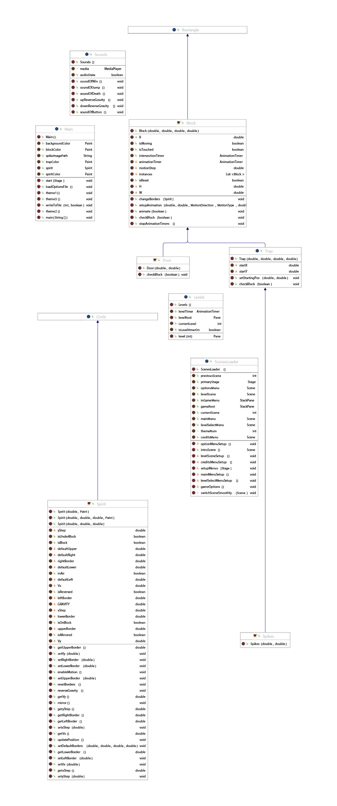

# !Trust
!Trust is a challenging game inspired by some games like Trap Adventure series and similar trap-games. The game is designed to test the player's skill and patience with its unpredictable and difficult levels. The game was a college project about OOP and GUI using java.

The main objective of !Trust is for the player to navigate through various levels filled with traps and obstacles to reach the end goal. The game emphasizes precise control, quick reflexes, and trial-and-error learning.

### Gameplay Mechanics
<i><b>Player movement:</i></b> The player can move left, right, and jump to navigate through the levels. 
<i><b>Traps and obstacles:</i></b> Various hidden traps such as spikes, falling platforms, and unexpected projectiles that challenge the player. 
<i><b>Levels:</i></b> Multiple levels with increasing difficulty, each designed to test different aspects of the player's abilities.

### The game UML (unified modeling language)
The game uses OOP intensively to simplify the development process and make the code well-contained and easy to debug.

[Download the game](https://drive.google.com/drive/folders/10r_UvL6_esxOY1Wb5qX2bg7B_zMmk8rd)

